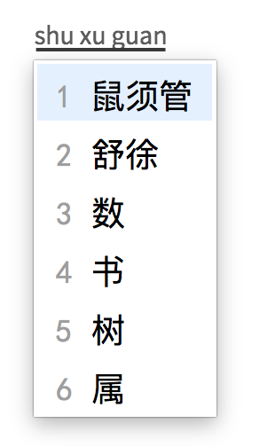
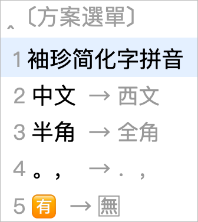

# 闲耘的 Rime 配置说明



[Rime](https://github.com/rime) 输入法是一款适用于 Mac OSX, Linux,
Windows 的输入法，Rime 在不同平台下的对应名称如下：

* Mac OSX: 鼠鬚管 ([Squirrel](https://github.com/rime/squirrel))
    配置目录：`~/Library/Rime/`
* Linux: 中州韻 (ibus-rime)
    配置目录：`~/.config/ibus/rime/`
* Windows: 小狼毫 (Weasel)
    配置目录：`%APPDATA%\Rime`

Rime 的配置文件不同平台的放置在不同的目录，
在配置目录中，主要使用 `yaml` 进行配置。
目录中自有的配置文件不建议直接修改，因为可能会被自动复写。
用户配置一般以原始配置文件名增加 .custom 二级后缀的方式，
例如：Mac OSX 下的原始配置 `squirrel.yaml`，对应的用户配置就是
`squirrel.custom.yaml` 文件。

修改 `.custom` 配置后，『重新部署』Rime 输入法会将用户的配置增加或更新到
对应的原始配置中。

## 安裝

```
$ git clone git@github.com:hotoo/rime.git
$ cd rime
$ make install
```

卸载

```
$ cd rime
$ make uninstall
```

## 简体字

推荐使用 rime 官方的“袖珍简化字拼音”方案，安装方法先通过 `make install` 安装好
这个拼音方案后，可以如下操作修改简体输入法方案。

1. 输入法切到鼠须管。
2. `<Ctrl-~>`
3. `〔方案選單〕` 中，选择 `袖珍简化字拼音`，回车。
  
4. 再回车选择 `袖珍简化字拼音`。
   1. `袖珍简化字拼音` 输入模式名称。下面各项前面黑色字体代表当前选中，选择则会修改为箭头后面的配置。
   2. `西文 → 中文` 中文西文未搞清楚什么意思。
   3. `半角 → 全角` 阿拉伯数字使用半角模式，例如 `1` 而不是 `1`。
   4. `汉字 → 漢字` 简体中文。
   5. `。， → . ,` 中文标点符号使用的字符。
  

鼠须管默认是繁体字模式，且内置了“朙月拼音”和“朙月拼音・简化字”两种简体字输入方案，
但是这两者都是繁体码表，存在一简对多繁的问题，有些词语无法打出来：

- 朙月拼音(luna_pinyin)：使用繁体字码表，通过 opencc 转换成简体中文，由于繁体转
  简体过程中，由于一个简体字对应有多个繁体字的情况，目前造词不会穷举所有组合，
  只采用了字频较高的字以期减少错误，所以会出现某些词一直不会被记忆。例如
  [#251](https://github.com/rime/librime/issues/251)，我本人就是因为要做很多“复盘”
  工作而无法直接打出这个词而苦恼 [#437](https://github.com/rime/squirrel/issues/437)。
- 朙月拼音・简化字：我没怎么细究过。

注意：如果输入法方案选择 `朙月拼音・简化字` 则 luna_pinyin.custom.yaml 配置不生效。而且同一个
Mac 系统中，不同软件可以设置不同的输入法模式，比如 Chrome 的地址栏和 Chrome 中的文本输入框
的输入法模式可以不同，导致一个模糊音有效，另一个无效。

## 同步

installation.yaml

```yaml
installation_id: "hotoo.rmbp"
sync_dir: "/Users/hotoo/Dropbox/RimeSync"
```

## Emoji

安装操作已经内置到 `make install` 中。

1. 安装东风破 https://github.com/rime/plum
  ```bash
  curl -fsSL https://raw.githubusercontent.com/rime/plum/master/rime-install | bash
  ```
2. 安装 Emoji 插件 https://github.com/rime/rime-emoji
  ```bash
  bash rime-install emoji:customize:schema=luna_pinyin
  ```

## 参考
* [Rime 定製指南](https://github.com/rime/home/wiki/CustomizationGuide)
* [中州韵（小狼毫，鼠须管）输入法设置](http://blog.yesmryang.net/rime-setting/)
* [說明書#同步用戶資料](https://github.com/rime/home/wiki/UserGuide#同步用戶資料)
* [Author: 佛振 (lotem)@github](https://github.com/lotem)
* [如何从 QIM 迁移至 Squirrel（鼠鬚管）](http://cocoabob.ddns.net/?p=919)
